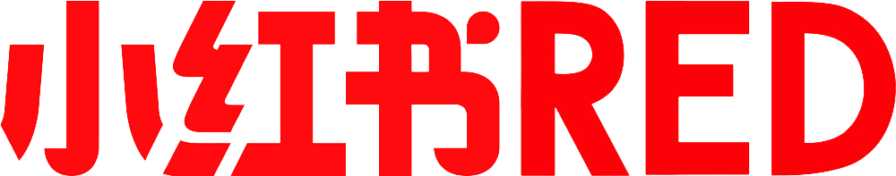

## About Me

Currently, I am a third-year master's student majoring in Computational Linguistics in the [Institute of Applied Linguistics](https://sfl.pku.edu.cn/) at [Peking Univeristy](https://www.pku.edu.cn/), advised by [Prof. Yanmei Gao](https://sfl.pku.edu.cn/szdw1/zzjs/wgyyxjyyyyxyjs_20220407164432484604/gym/index.htm). I am also a visting student in [Wangxuan Institute of Computer Technology](https://www.icst.pku.edu.cn/) with [Prof. Xiaojun Wan](https://wanxiaojun.github.io/) being my advisor. Prior to my graduate study, I received my bachelor’s degree in Applied Linguistics from [Sun Yat-Sen University](https://www.sysu.edu.cn/). 

I used to work as an NLP intern at ByteDance AI-Lab and Baidu. Before that, I was an Data Analyst intern in Xiaohongshu. Currently, I'm an research intern in Microsoft STC Asia - DKI group, where I work under the mentorship of [Dr. Mengyu Zhou](https://www.microsoft.com/en-us/research/people/mezho/) and focus on the research/applications of LLMs + Table.

I'm from a dual background in both linguistics and computer science. So my research interests include Natural Language Processing, Large Language Model, and Linguistics. In particular, I focus on the following domains:
- ***Linguistics*** &nbsp;&nbsp; Semantic and pragmatic analysis of conversations/user queries
- ***LLM Finetuning***  &nbsp;&nbsp;&nbsp;Finetune LLMs for domain-specific applications, esp. tabular data
- ***LLM Compression***  &nbsp;&nbsp;Model & Prompt Compression for faster inference
- ***Data Contamination*** &nbsp;&nbsp; Detect training data contamination for fair LLMs comparisons

## News
- 🔥*2024.09* &nbsp;&nbsp;Three papers are accepeted by EMNLP!
- *2024.01* &nbsp;&nbsp;I started my internship in Microsoft STCA, DKI Group! 

## Internship
- *2024.01 - present* &nbsp;&nbsp;&nbsp;&nbsp; [Microsoft STCA](https://www.microsoft.com/en-us/research/group/data-knowledge-intelligence/), DKI Group, Beijing 
- *2023.09 - 2023.12* &nbsp;&nbsp;&nbsp;[Baidu ERNIE Bot]((https://nlp.baidu.com/homepage/index)), NLP intern, Beijing 
- *2023.02 - 2023.06*  &nbsp;&nbsp;[ByteDance AI lab](https://www.bytedance.com/en/), NLP intern, Beijing 
- *2022.05 - 2022.09*  &nbsp;&nbsp;[Xiaohongshu](√), Data Analyst Intern, Shanghai 

## Education

- *2022.09 - 2025.06* &nbsp;&nbsp;M.S, Peking University, Beijing
- *2018.09 - 2022.06* &nbsp;&nbsp;B.S, Sun Yat-Sen University, Guangzhou
- *2023.06 - 2023.08* &nbsp;&nbsp;Exchange Student, Stanford Univeristy, CA

## Awards
- *2022.06* &nbsp;&nbsp;Excellent Undergraduate Thesis of SYSU
- *2022.06* &nbsp;&nbsp;Outstanding Graduate of SYSU

<!--  -->



## Resources

- My personal post: [Skyler's blog page](https://my-page-ten-tau.vercel.app/about)